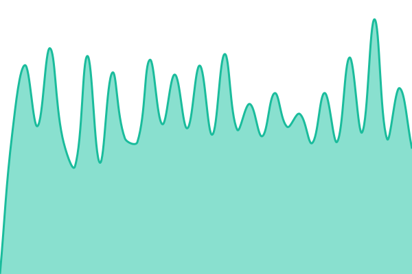
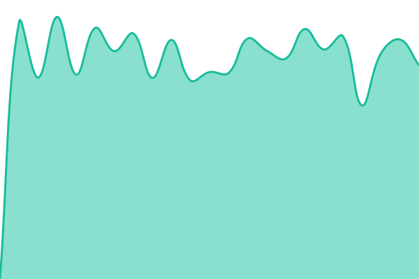

# 

This repository contains the open-source uptime monitor and status page for [Darren Snee](https://ec-snee.github.io/gobeyond-uptime), powered by [Upptime](https://github.com/upptime/upptime).

With [Upptime](https://upptime.js.org), you can get your own unlimited and free uptime monitor and status page, powered entirely by a GitHub repository. We use [Issues](https://github.com/ec-snee/gobeyond-uptime/issues) as incident reports, [Actions](https://github.com/ec-snee/gobeyond-uptime/actions) as uptime monitors, and [Pages](https://ec-snee.github.io/gobeyond-uptime) for the status page.

<!--start: status pages-->
<!-- This summary is generated by Upptime (https://github.com/upptime/upptime) -->
<!-- Do not edit this manually, your changes will be overwritten -->
<!-- prettier-ignore -->
| URL | Status | History | Response Time | Uptime |
| --- | ------ | ------- | ------------- | ------ |
|  [Gobeyond API](https://api.gobeyond-project.eu/wms/?service=WMS&version=1.3.0&request=GetCapabilities) | 🟨 Degraded | [gobeyond-api.yml](https://github.com/ec-snee/gobeyond-uptime/commits/HEAD/history/gobeyond-api.yml) | 

 1093ms
     
 | 

<a href="https://ec-snee.github.io/gobeyond-uptime/history/gobeyond-api">56.87%</a>
    

|  [Gobeyond Upstream](https://api.gobeyond-project.eu/health-check) | 🟩 Up | [gobeyond-upstream.yml](https://github.com/ec-snee/gobeyond-uptime/commits/HEAD/history/gobeyond-upstream.yml) | 

 740ms
     
 | 

<a href="https://ec-snee.github.io/gobeyond-uptime/history/gobeyond-upstream">99.46%</a>
    

|  [Gobeyond Dev API](https://api-02.ecmwf-gobeyond.f.ewcloud.host/wms/?service=WMS&version=1.3.0&request=GetCapabilities) | 🟨 Degraded | [gobeyond-dev-api.yml](https://github.com/ec-snee/gobeyond-uptime/commits/HEAD/history/gobeyond-dev-api.yml) | 

 970ms
     
 | 

<a href="https://ec-snee.github.io/gobeyond-uptime/history/gobeyond-dev-api">80.21%</a>
    

|  [Gobeyond Dev Upstream](https://api-02.ecmwf-gobeyond.f.ewcloud.host/health-check) | 🟩 Up | [gobeyond-dev-upstream.yml](https://github.com/ec-snee/gobeyond-uptime/commits/HEAD/history/gobeyond-dev-upstream.yml) | 

 495ms
     
 | 

<a href="https://ec-snee.github.io/gobeyond-uptime/history/gobeyond-dev-upstream">99.46%</a>
    

<!--end: status pages-->

## 📄 License

- Powered by: [Upptime](https://github.com/upptime/upptime)
- Code: [MIT](./LICENSE) © [Anand Chowdhary](https://anandchowdhary.com), supported by [Pabio](https://pabio.com)
- Data in the `./history` directory: [Open Database License](https://opendatacommons.org/licenses/odbl/1-0/)
